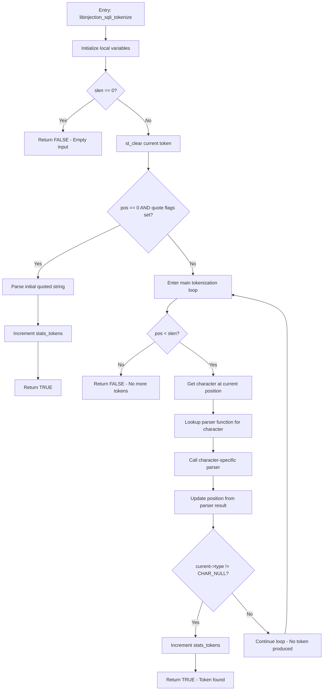

# Phase 1.1: Algorithmic Understanding - libinjection_sqli_tokenize

## Function Overview
**Location**: `libinjection-c/src/libinjection_sqli.c:1195-1247`  
**Signature**: `int libinjection_sqli_tokenize(struct libinjection_sqli_state *sf)`

## 1. High-Level Behavioral Flowchart

## 2. State Machine Analysis

**State Machine Type**: Position-based streaming tokenizer with character dispatch

### States:
1. **INITIAL**: Beginning of function, checking for empty input
2. **QUOTE_CONTEXT**: Special handling when quote flags are set at position 0
3. **MAIN_LOOP**: Character-by-character parsing loop
4. **CHAR_DISPATCH**: Dispatching to character-specific parsers
5. **TOKEN_EVALUATION**: Checking if a token was produced
6. **SUCCESS**: Valid token found and returned
7. **FAILURE**: No token found (end of input or empty input)

### State Transition Table:
| From State | Condition | Next State | Action |
|------------|-----------|------------|--------|
| INITIAL | slen == 0 | FAILURE | Return FALSE |
| INITIAL | slen > 0 | QUOTE_CONTEXT | Clear current token |
| QUOTE_CONTEXT | pos == 0 && quote flags | SUCCESS | Parse quoted string, return TRUE |
| QUOTE_CONTEXT | !(pos == 0 && quote flags) | MAIN_LOOP | Enter main parsing loop |
| MAIN_LOOP | pos >= slen | FAILURE | Return FALSE |
| MAIN_LOOP | pos < slen | CHAR_DISPATCH | Get character, lookup parser |
| CHAR_DISPATCH | Always | TOKEN_EVALUATION | Call parser, update position |
| TOKEN_EVALUATION | current->type != CHAR_NULL | SUCCESS | Increment stats, return TRUE |
| TOKEN_EVALUATION | current->type == CHAR_NULL | MAIN_LOOP | Continue parsing |

### Unreachable States: None identified

## 3. Execution Path Enumeration

### Path 1: Empty Input
- **Entry conditions**: `slen == 0`
- **Operations**: Immediate check and return
- **Variables modified**: None
- **Exit conditions**: Return FALSE

### Path 2: Quoted String at Beginning
- **Entry conditions**: `pos == 0` AND `(flags & (FLAG_QUOTE_SINGLE | FLAG_QUOTE_DOUBLE))`
- **Operations**: 
  - Clear current token
  - Call `parse_string_core` with appropriate delimiter
  - Update position
  - Increment `stats_tokens`
- **Variables modified**: `sf->pos`, `sf->stats_tokens`, `sf->current`
- **Exit conditions**: Return TRUE

### Path 3: Main Loop - Token Found
- **Entry conditions**: Normal parsing, character produces token
- **Operations**:
  - Clear current token
  - Loop through characters
  - Lookup and call character parser
  - Parser produces token (sets `current->type != CHAR_NULL`)
  - Increment `stats_tokens`
- **Variables modified**: `sf->pos`, `sf->stats_tokens`, `sf->current`
- **Exit conditions**: Return TRUE

### Path 4: Main Loop - No Token (End of Input)
- **Entry conditions**: Normal parsing, reach end without token
- **Operations**:
  - Clear current token
  - Loop through characters
  - All parsers return without setting token type
  - Reach end of input
- **Variables modified**: `sf->pos`, `sf->current`
- **Exit conditions**: Return FALSE

### Path 5: Main Loop - Token Found After Multiple Characters
- **Entry conditions**: Normal parsing, some characters don't produce tokens
- **Operations**:
  - Clear current token
  - Loop through multiple characters
  - Some parsers don't produce tokens (whitespace, etc.)
  - Eventually find character that produces token
  - Increment `stats_tokens`
- **Variables modified**: `sf->pos`, `sf->stats_tokens`, `sf->current`
- **Exit conditions**: Return TRUE

## 4. Function Purpose Analysis

### Core Algorithm
The function implements a **streaming character-dispatch tokenizer** for SQL injection detection. It processes one token at a time from an input string, using a lookup table to dispatch each character to its appropriate parsing function.

### Problem Solved
- **Primary**: Extract the next meaningful SQL token from input stream
- **Secondary**: Handle different SQL dialects and quoting contexts
- **Tertiary**: Maintain parsing state and statistics

### Key Invariants Maintained
1. **Position Monotonicity**: `sf->pos` never decreases
2. **Single Token**: Exactly one token is produced per successful call
3. **State Consistency**: `sf->current` always reflects the current token state
4. **Statistics Accuracy**: `sf->stats_tokens` correctly counts produced tokens

### Relationship to Overall Architecture
This is the **foundational layer** of libinjection:
- **Input**: Raw string + parsing state
- **Output**: Single token + updated state
- **Used By**: `libinjection_sqli_fold()` which calls this repeatedly
- **Dependencies**: Character-specific parsers in parse function table
- **Role**: Converts raw SQL text into structured token stream for analysis

### Design Patterns
1. **Character Dispatch**: Uses function pointer table for O(1) character handling
2. **Streaming**: Processes input incrementally, one token at a time
3. **State Machine**: Maintains position and context between calls
4. **Context-Aware**: Special handling for different SQL quoting modes